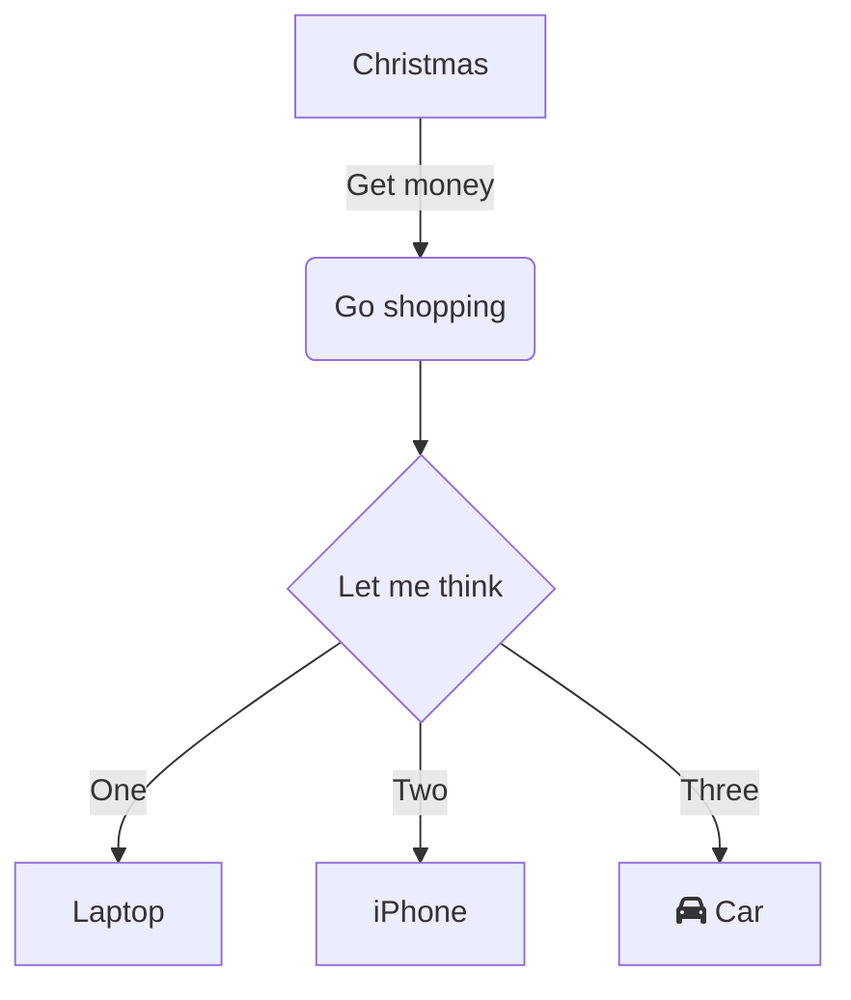
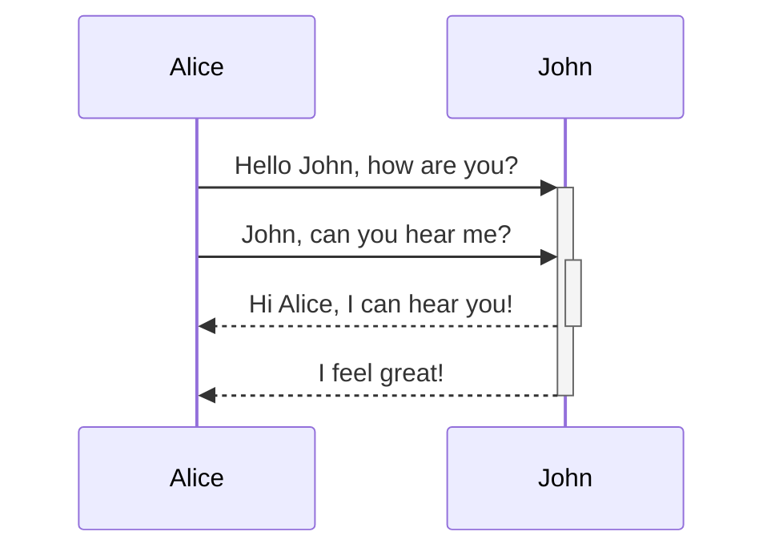

# Mermaid

## What is it, Why is it awesome


---

# What is it
&nbsp;

"JavaScript based diagramming and charting tool that renders Markdown-inspired text definitions to create and modify diagrams dynamically." - Them

<br>
<br>

"Super simple way to make diagrams from text only input" - Me

---

# Why is it good? (Them)

- ➕ Easy to use!
  - Easily create and render detailed diagrams and charts with the Mermaid Live Editor.
- 🧩 Integrations available!
  - Use Mermaid with your favorite applications, check out the integrations list.
- 🏆 Award Winning!
  - 2019 JavaScript Open Source Award winner for "The Most Exciting Use of Technology".
- 🥰 Mermaid + Mermaid Chart
  - Mermaid Chart is a major supporter of the Mermaid project.

---

# Why is it good? (Me)
&nbsp;

Its text based
- Means its super light weight
  - 5-30ish lines of text
  - Can just send it over slack
- Dual representation
- Easy to edit
- We have a _ton_ of tools for managing text
  - Use your favorite editor
    - Most markdown editors just support it natively
  - Mange it with git
  - Can easily `diff` them
---

# Why is it good? (Me)
&nbsp;

Its simple (ish)
- Super fast to learn
- Usually pretty human readable
- You don't have direct control of layout
  - Usually you're trying too hard anyway
- Most charts let you do what you want easily
  - And can be pushed past with HTML magic
- Mostly is `one program that does one thing well`

---
layout: two-cols
---

# Small Example

```
flowchart TD
    A[Christmas] -->|Get money| B(Go shopping)
    B --> C{Let me think}
    C -->|One| D[Laptop]
    C -->|Two| E[iPhone]
    C -->|Three| F[fa:fa-car Car]
```

::right::



---
layout: two-cols
---

# Small Example

```
sequenceDiagram
    Alice->>+John: Hello John, how are you?
    Alice->>+John: John, can you hear me?
    John-->>-Alice: Hi Alice, I can hear you!
    John-->>-Alice: I feel great!
```

::right::



---
src: ./subsections/gallery.md
---

---

# What are good tools?
- Mermaid Documentation: https://mermaid.js.org/intro/
  - Well written and simple
  - Pick the diagram you want and see all your options
- Mermaid Live:  https://mermaid.live
  - Online live render editor
  - Has sample diagram
  - Supports saving and loading
  - Exporting images and static image links
- Mermaid Chart: https://www.mermaidchart.com/
  - Beefed up Mermaid Live
    - "commercial product built on top of the open source project Mermaid."
  - Has `Team` based sharing options
  - Has no text/ visual editing: https://docs.mermaidchart.com/guides/visual-editor

---
layout: image
image: images/gh-example.png
backgroundSize: 90%
---

# Integrated with Github!

---
layout: image
image: images/vscode-example.png
backgroundSize: 90%
---

# Integrated with VS Code!

---
layout: image
image: images/obsidian-example.jpg
backgroundSize: 70%
---

# Integrated with Obsidian!

---

# Not Integrated with Confluence 😭
- Two options
  - Embed an image on the page
  - Use mermaid live to get a static link
- Both cases _do not_ keep the source in the same place
  - Store it somewhere it can be extended
    - On the page somewhere
- Show example links
