# Advanced Flowcharts

---

# Nodes
```
%%{init: {"flowchart": {"htmlLabels": false}} }%%
graph TD
    a
    b[A Node with text]
    c["This ❤ Unicode"]
    d["A node with special mermaid characters ]()"]
    markdown["`This **is** _Markdown_`"]
    newLines["`Line1
    Line 2
    Line 3`"]
```

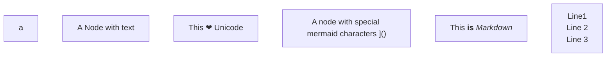

---

# Node Shapes

```
flowchart LR
    roundEdge(Round Edged Node) -->
    stadium([Stadium Shaped Node]) -->
    subroutine[[Subroutine Node]] -->
    database[(Database Node)]
    circle((Circle)) -->
    flagShape>Flagshape] -->
    diamond{Diamond} -->
    hexagon{{Hexagon}}
```

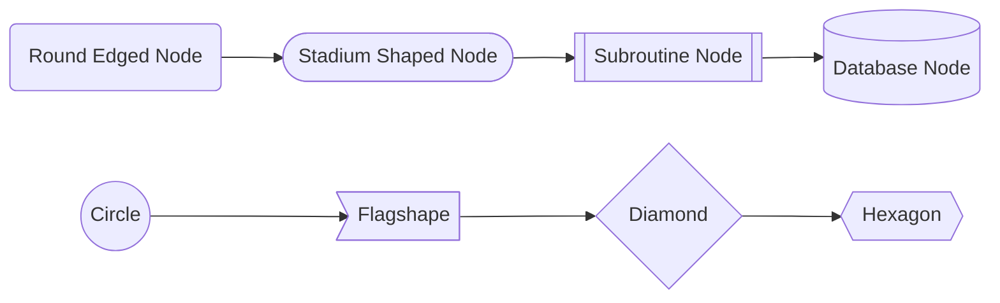

---

# Node Shapes (ctnd)

```
    parallelogram[/Parallelogram/] -->
    parallelogramAlt[\Parallelogram Alt\] -->
    trapezoid[/Trapezoid\]
    trapezoidAlt[\Trapezoid Alt/] -->
    doubleCircle(((Double Circle)))
```

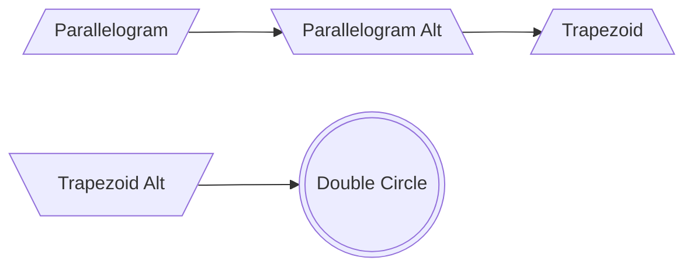

---
layout: two-cols
---

# Direction

```
graph LR
    a --> b
```

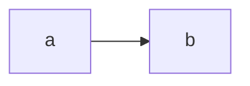

```
graph RL
    a --> b
```

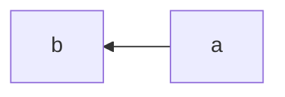

```
graph BT
    a --> b
```

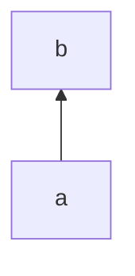

::right::
<br>
<br>

```
graph TD
    a --> b
```

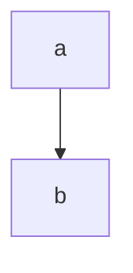

```
graph TB
    a --> b
```


---

# Links

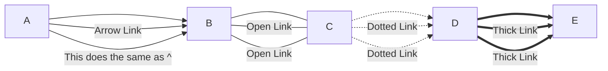

```
flowchart LR
    A-->B
    A--  Arrow Link -->B
    A-->|This does the same as ^| B
    B---C
    B-- Open Link ---C
    B---| Open Link |C
    C-.->D
    C-. Dotted Link .-> D
    C-.->|Dotted Link|D
    D ==> E
    D == Thick Link ==> E
    D ==> |Thick Link| E
```

---

# More Links

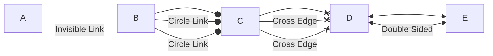

```
flowchart LR
    A~~~B
    A~~~ |Invisible Link|B
    B --o C
    B --o |Circle Link| C
    B -- Circle Link --o C
    C --x D
    C --x |Cross Edge| D
    C -- Cross Edge --x D
    D <--> E
    D <--> |Double Sided| E
```

---
layout: two-cols
---

# Chaining of Nodes

```
flowchart TB
    a --> b --> c --> d
    e --> f & g --> h
    i & j --> k & l
```

The last one would take
```
flowchart TB
    i --> k
    i --> l
    j --> k
    j --> l
```

::right::
<br>
<br>
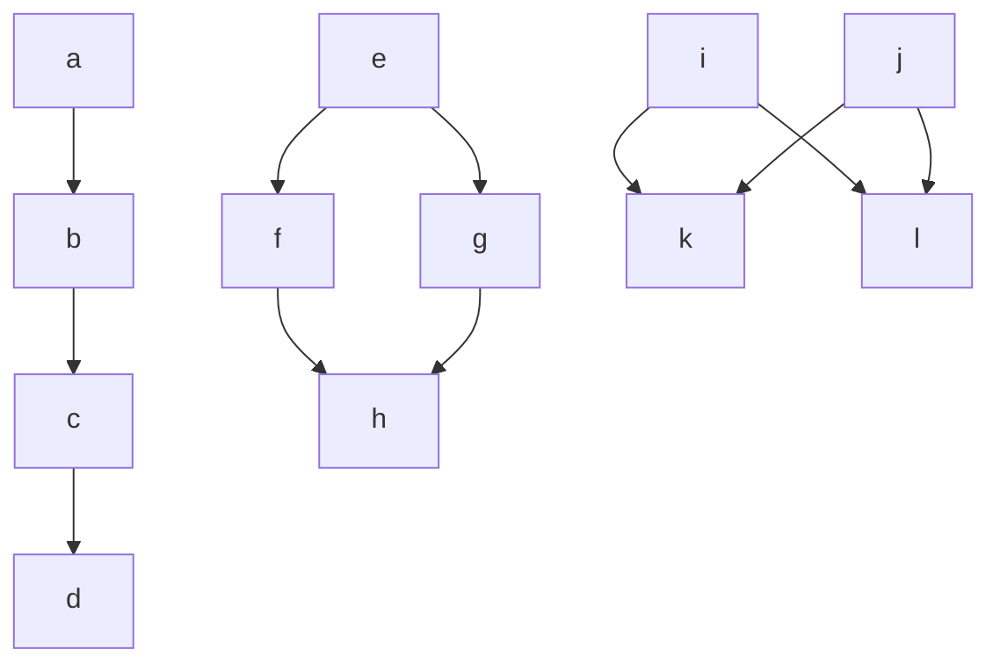

---

# Length of Links
- Each node in the flowchart is assigned to a rank in the graph
- you can ask a link to be longer by adding extra dashes in the link definition
```
flowchart LR
    A[Start] --> B{Is it?}
    B -->|Shortest| C[End]
    B --->|Longer| D[End]
    B ---->|Longerer| E[End]
    B --------->|LONG| F[End]
```

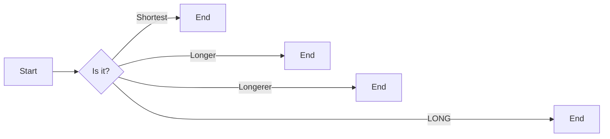

---
layout: two-cols
---

# Subgraphs

```
flowchart TB
    c1-->a2
    subgraph one
        a1-->a2
    end
    subgraph two
        b1-->b2
    end
    subgraph three
        c1-->c2
    end
```
::right::
<br>
<br>
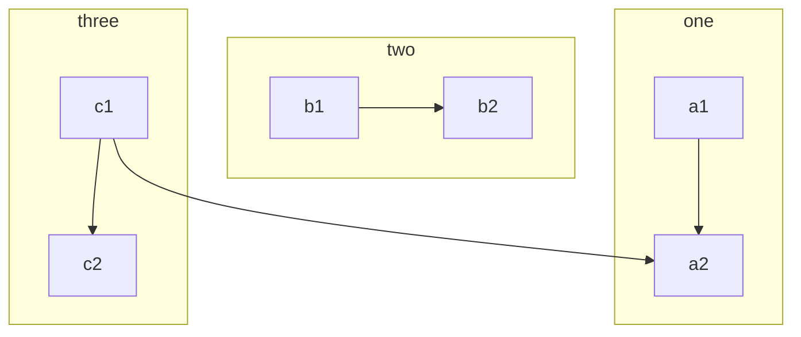

---
layout: two-cols
---

# Links Between Subgraphs

```
graph TB
    c1-->a2
    subgraph one
        a1-->a2
    end
    subgraph two
        b1-->b2
    end
    subgraph three
        c1-->c2
    end

    one --> two
    three --> two
    two --> c2
```
::right::
<br>
<br>
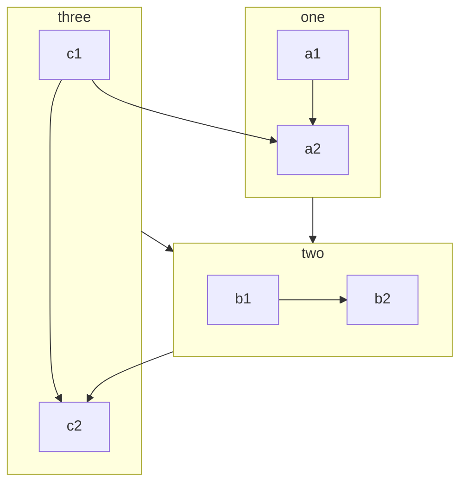

---
layout: two-cols
---

# Direction Inside of Subgraphs

```
flowchart LR
  subgraph TOP
    direction TB
    subgraph B1
        direction RL
        i1 -->f1
    end
    subgraph B2
        direction BT
        i2 -->f2
    end
  end

  A --> TOP --> B
  B1 --> B2
```
::right::
<br>
<br>
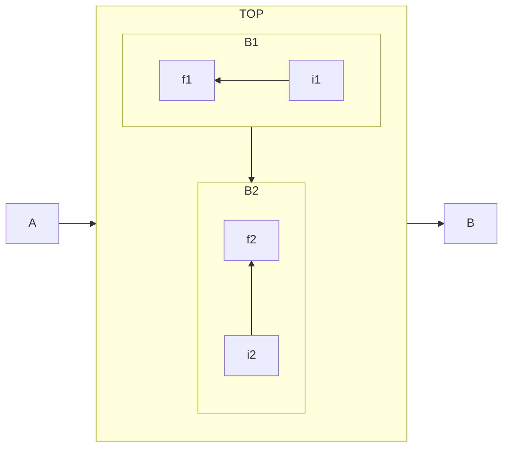

---

# Comments

```
flowchart LR
    %% this is a comment A -- text --> B{node}
    A -- text --> B -- text2 --> C
    %% this is another comment
```
<br>
<br>
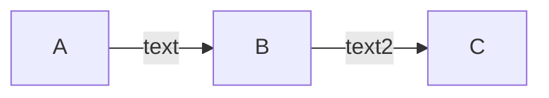

---

# Styling Links

```
flowchart LR
    a --> |Some Text| b --> c --> d --> e --> f
    linkStyle 0 stroke:red,stroke-width:4px,color:blue;
    linkStyle 4 stroke:yellow,stroke-width:4px,color:blue;
```
<br>
<br>
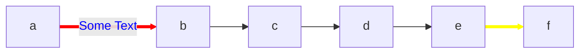

---
layout: two-cols
---

# Line Curves

Full list: https://d3js.org/d3-shape/curve

Normal
```
graph LR
    a --> |Some Text| b
    b --> c
    c --> a
```

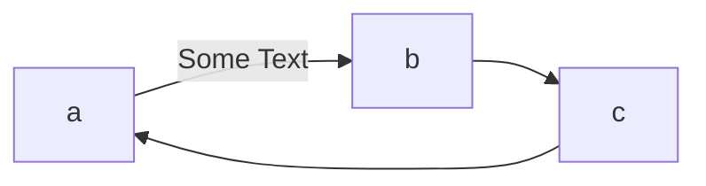

::right::
<br>
<br>

stepBefore
```
%%{ init: { 'flowchart': { 'curve': 'stepBefore' } } }%%
graph LR
    a --> |Some Text| b
    b --> c
    c --> a
    c --> d
    d --> a
```
<br>
<br>

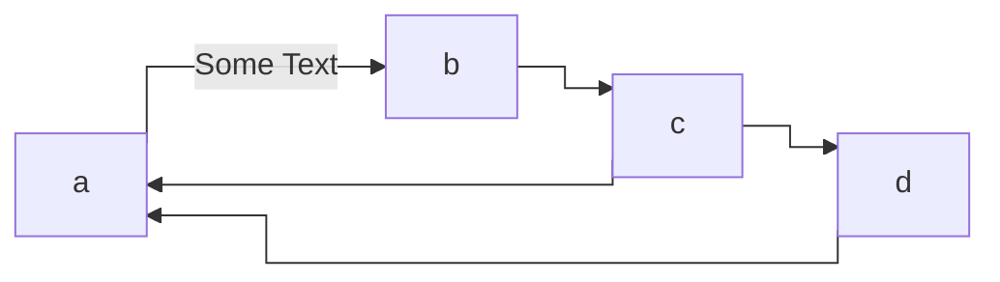

---
layout: two-cols
---

# Line Curves (more)
<br>

- basis
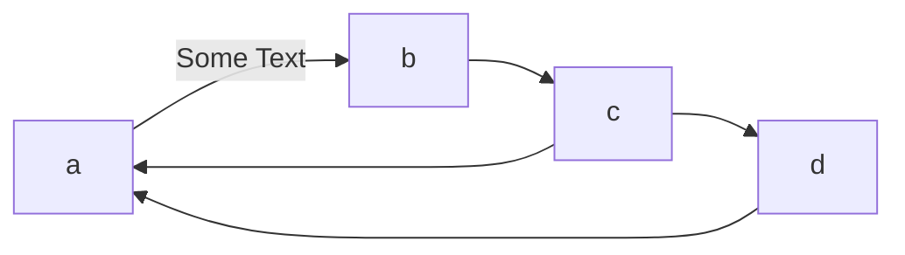

- bumpX
```mermaid
%%{ init: { 'flowchart': { 'curve': 'bumpX' } } }%%
graph LR
    a --> |Some Text| b
    b --> c
    c --> a
    c --> d
    d --> a
```
::right::
<br>
<br>

- bumpY
```mermaid
%%{ init: { 'flowchart': { 'curve': 'bumpY' } } }%%
graph LR
    a --> |Some Text| b
    b --> c
    c --> a
    c --> d
    d --> a
```

- cardinal
```mermaid
%%{ init: { 'flowchart': { 'curve': 'cardinal' } } }%%
graph LR
    a --> |Some Text| b
    b --> c
    c --> a
    c --> d
    d --> a
```

---
layout: two-cols
---

# Line Curves (more)
<br>

- catmullRom
```mermaid
%%{ init: { 'flowchart': { 'curve': 'catmullRom' } } }%%
graph LR
    a --> |Some Text| b
    b --> c
    c --> a
    c --> d
    d --> a
```

- linear
```mermaid
%%{ init: { 'flowchart': { 'curve': 'linear' } } }%%
graph LR
    a --> |Some Text| b
    b --> c
    c --> a
    c --> d
    d --> a
```

::right::
<br>
<br>

- monotoneX
```mermaid
%%{ init: { 'flowchart': { 'curve': 'monotoneX' } } }%%
graph LR
    a --> |Some Text| b
    b --> c
    c --> a
    c --> d
    d --> a
```

- monotoneY
```mermaid
%%{ init: { 'flowchart': { 'curve': 'monotoneY' } } }%%
graph LR
    a --> |Some Text| b
    b --> c
    c --> a
    c --> d
    d --> a
```

---
layout: two-cols
---

# Line Curves (more)
<br>

- natural
```mermaid
%%{ init: { 'flowchart': { 'curve': 'natural' } } }%%
graph LR
    a --> |Some Text| b
    b --> c
    c --> a
    c --> d
    d --> a
```

- step
```mermaid
%%{ init: { 'flowchart': { 'curve': 'step' } } }%%
graph LR
    a --> |Some Text| b
    b --> c
    c --> a
    c --> d
    d --> a
```

::right::
<br>
<br>

- stepAfter
```mermaid
%%{ init: { 'flowchart': { 'curve': 'stepAfter' } } }%%
graph LR
    a --> |Some Text| b
    b --> c
    c --> a
    c --> d
    d --> a
```

- stepBefore
```mermaid
%%{ init: { 'flowchart': { 'curve': 'stepBefore' } } }%%
graph LR
    a --> |Some Text| b
    b --> c
    c --> a
    c --> d
    d --> a
```

---

# Styling Specific Nodes

```
flowchart LR
    style id1 fill:#f9f,stroke:#333,stroke-width:4px
    style id2 fill:#bbf,stroke:#f66,stroke-width:2px,color:#fff,stroke-dasharray: 5 5

    id1(Start)-->id2(Stop)
```
<br>
<br>
```mermaid
flowchart LR
    style id1 fill:#f9f,stroke:#333,stroke-width:4px
    style id2 fill:#bbf,stroke:#f66,stroke-width:2px,color:#fff,stroke-dasharray: 5 5

    id1(Start)-->id2(Stop)
```

---
layout: two-cols
---

# Styling Nodes With Classes

```
flowchart LR
    A:::someclass --> B
    classDef someclass fill:#f96
```
<br>
<br>

```
flowchart LR
    A:::foo & B:::bar --> C:::foobar
    classDef foo stroke:#f00
    classDef bar stroke:#0f0
    classDef foobar stroke:#00f
```

::right::
<br>
<br>
<br>
<br>

```mermaid
flowchart LR
    A:::someclass --> B
    classDef someclass fill:#f96
```

<br>
<br>
<br>
```mermaid
flowchart LR
    A:::foo & B:::bar --> C:::foobar
    classDef foo stroke:#f00
    classDef bar stroke:#0f0
    classDef foobar stroke:#00f
```

---
layout: two-cols
---

# Styling Subgraphs With Classes

```
flowchart TB
classDef someclass fill:#f96

one:::someclass

    c1-->a2
    subgraph one
    a1-->a2
    end
    subgraph two
    b1-->b2
    end
    subgraph three
    c1-->c2
    end
```
::right::
<br>
<br>
<br>
<br>

```mermaid
flowchart TB
classDef someclass fill:#f96

one:::someclass

    c1-->a2
    subgraph one
    a1-->a2
    end
    subgraph two
    b1-->b2
    end
    subgraph three
    c1-->c2
    end
```

---

# Styling Default Classes

```
flowchart LR
    classDef default fill:#f9f,stroke:#333,stroke-width:4px;
    a --> |Some Text| b
    b --> c
    c --> a
    c --> d
    d --> a
```

```mermaid
flowchart LR
    classDef default fill:#f9f,stroke:#333,stroke-width:4px;
    a --> |Some Text| b
    b --> c
    c --> a
    c --> d
    d --> a
```

---

# Interaction

https://mermaid.js.org/syntax/flowchart.html#interaction
