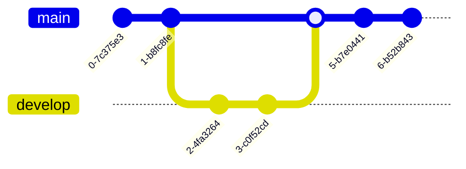

# What all can you make?
- **Flowcharts**
- Sequence diagrams
- Class diagrams (UML)
- State diagrams
- Entity Relationship Diagrams
- User Journey Diagram
- Gantt Chart
- Pie chart
- Quadrant Chart
- Requirement Diagram
- Gitgraph Diagram
- Mindmap Diagram
- Timeline Diagram

::right::
<br>
<br>
<br>

- ZenUML
- Sankey
- C4 Diagrams 🚧
- XY Chart 🔥
- Block Diagrams 🔥
- More all the time!


---
layout: two-cols
---
# Flowchart
```
flowchart TD
    A[Christmas] -->|Get money| B(Go shopping)
    B --> C{Let me think}
    C -->|One| D[Laptop]
    C -->|Two| E[iPhone]
    C -->|Three| F[fa:fa-car Car]
```

::right::


---
layout: two-cols
---
# Sequence Diagram
```
sequenceDiagram
    Alice->>+John: Hello John, how are you?
    Alice->>+John: John, can you hear me?
    John-->>-Alice: Hi Alice, I can hear you!
    John-->>-Alice: I feel great!
```

::right::
<br>
<br>


---
layout: two-cols
---
# Class Diagram
```
classDiagram
    Animal <|-- Duck
    Animal <|-- Fish
    Animal <|-- Zebra
    Animal : +int age
    Animal : +String gender
    Animal: +isMammal()
    Animal: +mate()
    class Duck{
      +String beakColor
      +swim()
      +quack()
    }
    class Fish{
      -int sizeInFeet
      -canEat()
    }
    class Zebra{
      +bool is_wild
      +run()
    }
```

::right::
<br>
<br>


---
layout: two-cols
---
# State Diagram
```
stateDiagram-v2
    [*] --> Still
    Still --> [*]
    Still --> Moving
    Moving --> Still
    Moving --> Crash
    Crash --> [*]
```

::right::
<br>
<br>


---
layout: two-cols
---
# ER Diagram (Entity Relationship Diagram)
```
erDiagram
    CUSTOMER }|..|{ DELIVERY-ADDRESS : has
    CUSTOMER ||--o{ ORDER : places
    CUSTOMER ||--o{ INVOICE : "liable for"
    DELIVERY-ADDRESS ||--o{ ORDER : receives
    INVOICE ||--|{ ORDER : covers
    ORDER ||--|{ ORDER-ITEM : includes
    PRODUCT-CATEGORY ||--|{ PRODUCT : contains
    PRODUCT ||--o{ ORDER-ITEM : "ordered in"
```

::right::
<br>
<br>


---
layout: two-cols
---
# Gantt Chart
```
gantt
    title A Gantt Diagram
    dateFormat  YYYY-MM-DD
    section Section
    A task           :a1, 2014-01-01, 30d
    Another task     :after a1  , 20d
    section Another
    Task in sec      :2014-01-12  , 12d
    another task      : 24d
```

::right::
<br>
<br>


---
layout: two-cols
---
# User Journey
```
journey
    title My working day
    section Go to work
      Make tea: 5: Me
      Go upstairs: 3: Me
      Do work: 1: Me, Cat
    section Go home
      Go downstairs: 5: Me
      Sit down: 3: Me
```

::right::
<br>
<br>


---
layout: two-cols
---
# Git Graph
```
gitGraph
    commit
    commit
    branch develop
    checkout develop
    commit
    commit
    checkout main
    merge develop
    commit
    commit
```

::right::
<br>
<br>



---
layout: two-cols
---
# Pie Chart
```
pie title Pets adopted by volunteers
    "Dogs" : 386
    "Cats" : 85
    "Rats" : 15
```

::right::
<br>
<br>


---
layout: two-cols
---
# Mind Map
```
mindmap
  root((mindmap))
    Origins
      Long history
      ::icon(fa fa-book)
      Popularisation
        British popular psychology author Tony Buzan
    Research
      On effectivness<br/>and features
      On Automatic creation
        Uses
            Creative techniques
            Strategic planning
            Argument mapping
    Tools
      Pen and paper
      Mermaid
```

::right::
<br>
<br>


---
layout: two-cols
---
# Quadrant Chart
```
quadrantChart
    title Reach and engagement of campaigns
    x-axis Low Reach --> High Reach
    y-axis Low Engagement --> High Engagement
    quadrant-1 We should expand
    quadrant-2 Need to promote
    quadrant-3 Re-evaluate
    quadrant-4 May be improved
    Campaign A: [0.3, 0.6]
    Campaign B: [0.45, 0.23]
    Campaign C: [0.57, 0.69]
    Campaign D: [0.78, 0.34]
    Campaign E: [0.40, 0.34]
    Campaign F: [0.35, 0.78]
```

::right::


---
layout: two-cols
---
# XY Chart (Beta)
```
xychart-beta
    title "Sales Revenue"
    x-axis [jan, feb, mar, apr, may, jun, jul, aug, sep, oct, nov, dec]
    y-axis "Revenue (in $)" 4000 --> 11000
    bar [5000, 6000, 7500, 8200, 9500, 10500, 11000, 10200, 9200, 8500, 7000, 6000]
    line [5000, 6000, 7500, 8200, 9500, 10500, 11000, 10200, 9200, 8500, 7000, 6000]
```

::right::
<br>
<br>


---
layout: two-cols
---
# Block Chart (Beta)
```
block-beta
    columns 3
    doc>"Document"]:3
    space down1<[" "]>(down) space

  block:e:3
          l["left"]
          m("A wide one in the middle")
          r["right"]
  end
    space down2<[" "]>(down) space
    db[("DB")]:3
    space:3
    D space C
    db --> D
    C --> db
    D --> C
    style m fill:#d6d,stroke:#333,stroke-width:4px

```

::right::
<br>
<br>


---
layout: two-cols
---
# Requirement Diagram
```
requirementDiagram

requirement test_req {
id: 1
text: the test text.
risk: high
verifymethod: test
}

element test_entity {
type: simulation
}

test_entity - satisfies -> test_req
```

::right::

