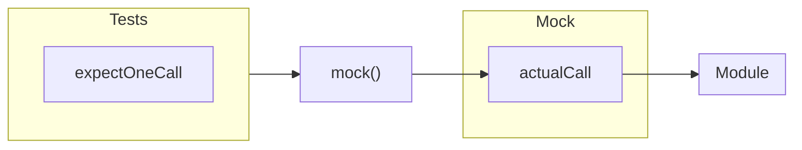

# How to use in C

---

# Cpputest Mock

https://cpputest.github.io/mocking_manual.html
- We use cpputest for our C testing
- We use their mocking system as well
  - For lua and js we use custom ones
    - https://github.com/ryanplusplus/mach.lua
    - https://github.com/ryanplusplus/mach.js
- Cpputest has pretty decent documentation

---

# Basic Expectations And Actuals

- All mocking calls are made to the global mock object
  - `mock()`
- This has many available functions
- The two most basic are
  - `mock().expectOneCall(functionName)`
  - `mock().actualCall(functionName)`
- Actual Calls are matched to Expected Calls by comparing the provided string

---

# Simplest Example

```c
TEST(mocks, simpletest)
{
   mock().expectOneCall("SomeFunction");
   mock().actualCall("SomeFunction");
}
```

<br>
<br>

```bash
.
OK (7503 tests, 1 ran, 1 checks, 0 ignored, 7502 filtered out, 15 ms)
```

---

# Simple Failures - Expected With No Actual

```c
TEST(mocks, simpletest)
{
   mock().expectOneCall("SomeFunction");
}
```

<br>
<br>

```shell
./test/Tests/Action/mocks_Test.cpp:20: error: Failure in TEST(mocks, simpletest)
        Mock Failure: Expected call WAS NOT fulfilled.
        EXPECTED calls that WERE NOT fulfilled:
                SomeFunction -> no parameters (expected 1 call, called 0 times)
        EXPECTED calls that WERE fulfilled:
                <none>

.
Errors (1 failures, 7503 tests, 1 ran, 1 checks, 0 ignored, 7502 filtered out, 16 ms)
```

---

# Simple Failures - Actual With No Expected

```c
TEST(mocks, simpletest)
{
   mock().actualCall("SomeFunction");
}
```

<br>
<br>

```bash
./test/Tests/Action/mocks_Test.cpp:20: error: Failure in TEST(mocks, simpletest)
        Mock Failure: Unexpected call to function: SomeFunction
        EXPECTED calls that WERE NOT fulfilled:
                <none>
        EXPECTED calls that WERE fulfilled:
                <none>

.
Errors (1 failures, 7503 tests, 1 ran, 0 checks, 0 ignored, 7502 filtered out, 16 ms)
```

---

# Make It Prettier

```c
   void ShouldCallSomeFunction()
   {
      mock().expectOneCall("SomeFunction");
   }

   void WhenThingThatMakesSomeFunctionBeCalledHappens()
   {
      mock().actualCall("SomeFunction");
   }

TEST(mocks, simpletest)
{
   ShouldCallSomeFunction();
   WhenThingThatMakesSomeFunctionBeCalledHappens();
}
```

<br>
<br>

```bash
.
OK (7503 tests, 1 ran, 1 checks, 0 ignored, 7502 filtered out, 15 ms)
```

---

# Make It Prettier

```c
   void ShouldCallSomeFunction()
   {
      mock().expectOneCall("SomeFunction"); // This will always be in the test file
   }

   void WhenThingThatMakesSomeFunctionBeCalledHappens()
   {
      mock().actualCall("SomeFunction"); // This _might_ be somewhere else, we'll talk more later
   }

TEST(mocks, simpletest)
{
   ShouldCallSomeFunction();
   WhenThingThatMakesSomeFunctionBeCalledHappens();
}
```

<br>
<br>

```bash
.
OK (7503 tests, 1 ran, 1 checks, 0 ignored, 7502 filtered out, 15 ms)
```

---

# What About Parameters?

`mock().expectOneCall(functionName).withParameter(name, value)`

- When calling an expected or actual call just chain call and add parameters
  - `.withParameter(...).withParameter(...).withParameter(...)`
- Will work for all basic types
  - `int`, `uint8_t`, `double`, `const char*` or `void*`
  - C++ magic takes care of this
- What about `withBoolParameter` or `withXParameter`?
  - `withParameter` will always use the appropriate type so no need to use
- What about other types?
  - See appendix


---

# Simple With Parameters

```c
   void ShouldCallSomeFunction(bool state)
   {
      mock().expectOneCall("SomeFunction").withParameter("state", state);
   }

   void WhenThingThatMakesSomeFunctionBeCalledHappens(bool state)
   {
      mock().actualCall("SomeFunction").withParameter("state", state);
   }

TEST(mocks, simpletest)
{
   ShouldCallSomeFunction(true);
   WhenThingThatMakesSomeFunctionBeCalledHappens(true);
}
```

<br>
<br>

```bash
.
OK (7503 tests, 1 ran, 1 checks, 0 ignored, 7502 filtered out, 17 ms)
```

---

# How They Change Errors

```c
TEST(mocks, simpletest)
{
   ShouldCallSomeFunction(true);
}
```
```bash
./test/Tests/Action/mocks_Test.cpp:27: error: Failure in TEST(mocks, simpletest)
        Mock Failure: Expected call WAS NOT fulfilled.
        EXPECTED calls that WERE NOT fulfilled:
                SomeFunction -> bool state: <true> (expected 1 call, called 0 times)
        EXPECTED calls that WERE fulfilled:
                <none>
```
```c
TEST(mocks, simpletest)
{
   WhenThingThatMakesSomeFunctionBeCalledHappens(false);
}
```
```bash
./test/Tests/Action/mocks_Test.cpp:27: error: Failure in TEST(mocks, simpletest)
        Mock Failure: Unexpected call to function: SomeFunction
        EXPECTED calls that WERE NOT fulfilled:
                <none>
        EXPECTED calls that WERE fulfilled:
                <none>
```

---

# How They Change Errors

```c{5}
TEST(mocks, simpletest)
{
   ShouldCallSomeFunction(true);
}
```
```bash{4}
./test/Tests/Action/mocks_Test.cpp:27: error: Failure in TEST(mocks, simpletest)
        Mock Failure: Expected call WAS NOT fulfilled.
        EXPECTED calls that WERE NOT fulfilled:
                SomeFunction -> bool state: <true> (expected 1 call, called 0 times)
        EXPECTED calls that WERE fulfilled:
                <none>
```
```c{5}
TEST(mocks, simpletest)
{
   WhenThingThatMakesSomeFunctionBeCalledHappens(false);
}
```
```bash{10}
./test/Tests/Action/mocks_Test.cpp:27: error: Failure in TEST(mocks, simpletest)
        Mock Failure: Unexpected call to function: SomeFunction
        EXPECTED calls that WERE NOT fulfilled:
                <none>
        EXPECTED calls that WERE fulfilled:
                <none>
```

---

# New Errors

```c{|none}
TEST(mocks, simpletest)
{
   ShouldCallSomeFunction(true);
   WhenThingThatMakesSomeFunctionBeCalledHappens(false);
}
```

```bash{all|2,3,4,7,8}
./test/Tests/Action/mocks_Test.cpp:27: error: Failure in TEST(mocks, simpletest)
        Mock Failure: Unexpected parameter value to parameter "state" to function "SomeFunction": <false>
        EXPECTED calls that WERE NOT fulfilled related to function: SomeFunction
                SomeFunction -> bool state: <true> (expected 1 call, called 0 times)
        EXPECTED calls that WERE fulfilled related to function: SomeFunction
                <none>
        ACTUAL unexpected parameter passed to function: SomeFunction
                bool state: <false>
```

---

# Many Parameters

```c
   void ShouldCallSomeFunction(bool state, TimerTicks_t ticks, uint8_t retries)
   {
      mock()
         .expectOneCall("SomeFunction")
         .withParameter("state", state)
         .withParameter("ticks", ticks)
         .withParameter("retries", retries);
   }

   void WhenThingThatMakesSomeFunctionBeCalledHappens(bool state, TimerTicks_t ticks, uint8_t retries)
   {
      mock()
         .actualCall("SomeFunction")
         .withParameter("state", state)
         .withParameter("ticks", ticks)
         .withParameter("retries", retries);
   }
```

---

# Returning Values

- For mocked functions that return you can chose what is used
- Sort of "reversed" from normal operation
- You set the data in the test and the code "gets" it
- The expected gets told which value to return
  - `mock().expectOneCall("SomeFunction").andReturnValue(someValue);`
- The actual fetches and uses that
  - `return mock().actualCall("SomeFunction").returnIntValue();`



---

# Returning Values

```c{|1,8,13,18,22,23,24}
   void ShouldCallSomeFunction(bool state, TimerTicks_t ticks, uint8_t retries, uint16_t result)
   {
      mock()
         .expectOneCall("SomeFunction")
         .withParameter("state", state)
         .withParameter("ticks", ticks)
         .withParameter("retries", retries)
         .andReturnValue(result);
   }

   uint16_t WhenThingThatMakesSomeFunctionBeCalledHappens(bool state, TimerTicks_t ticks, uint8_t retries)
   {
      return mock()
         .actualCall("SomeFunction")
         .withParameter("state", state)
         .withParameter("ticks", ticks)
         .withParameter("retries", retries)
         .returnIntValue();
   }
TEST(mocks, simpletest)
{
   ShouldCallSomeFunction(true, 1000, 5, 100);
   uint16_t result = WhenThingThatMakesSomeFunctionBeCalledHappens(true, 1000, 5);
   CHECK_EQUAL(100, result);
}
```
---

# onObject()

- A special form of `withParameter()`
- Used on the instance variable
- Makes sure the call is coming from the right copy of the mock
  - This is important when we use common mocks, where you may have more then one instance

<br>

```c{|3}
mock()
      .actualCall("Read")
      .onObject(instance)
```

---

# More Real Example

- Expected
```c
static void Write(I_Gpio_t *instance, const bool state)
{
   mock()
      .actualCall("Write")
      .onObject(instance)
      .withParameter("state", state);
}
```

- Actual

```c
Gpio_Mock_t gpioMock;

mock.expectOneCall("write").onObject(&gpioMock).withParameter("state", off);
Blinky_Init(&blinkyModule, &gpioMock.interface);
```

---

# Other Functions

- Expecting Several Calls
  - `mock().expectNCalls(5, "productionCode");`
  - In TDD I tend to just for loop my `expectOneCall`
- Buffers
  - When `uint8_t *buffer`
  - `.withMemoryBufferParameter("buffer", buffer, length);`
- Output Params
  - Same idea as returning, but for when is a modified pass by reference
  - `mock().expectOneCall("Foo").withOutputParameterReturning("bar", &outputValue, sizeof(outputValue));`
  - `mock().actualCall("Foo").withOutputParameter("bar", bar);`

---

# Expecting Nothing

- If you want to say no calls will occur, you don't actually need to do anything
- We often define `NothingShouldHappen()`
```
void NothingShouldHappen()
{

}
```

- Lets you be explicit
```
NothingShouldHappen();
WhenThingHappens();
```

- Mocking framework has a similiar option
  - `mock().expectNoCall("productionCode");`
  - This is the same as doing nothing though
