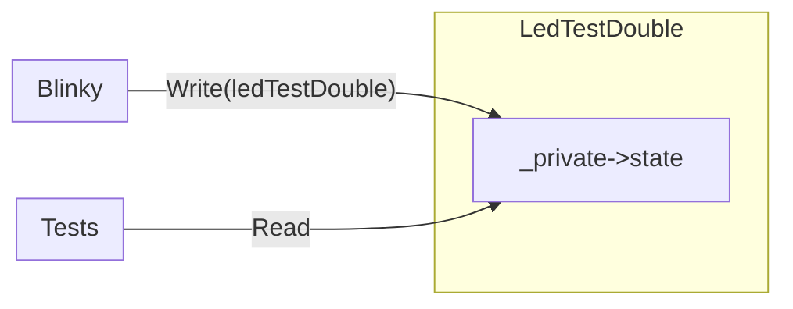
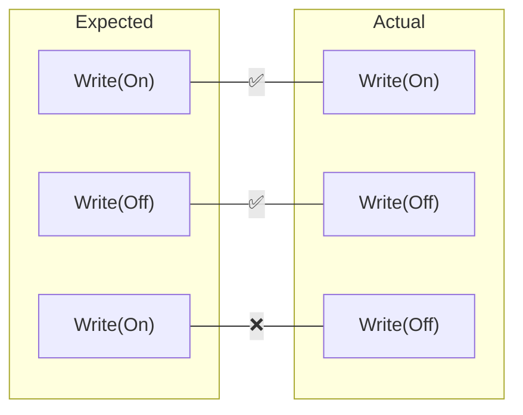
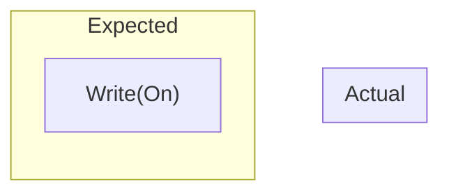
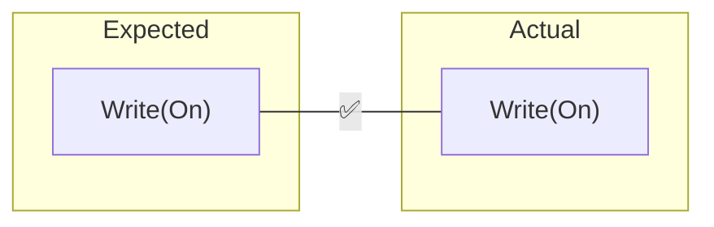
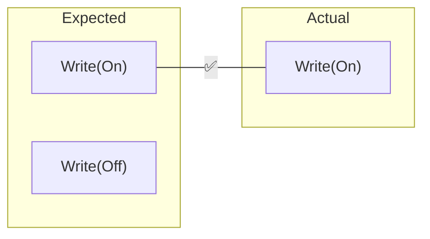
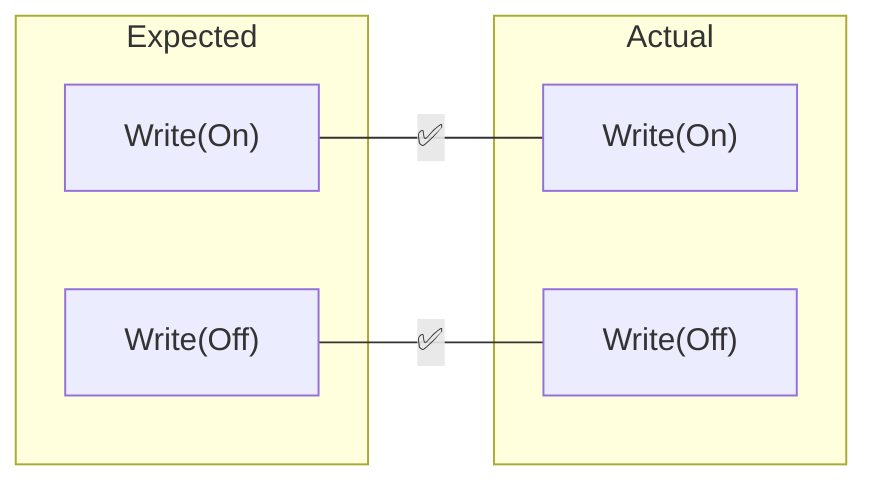
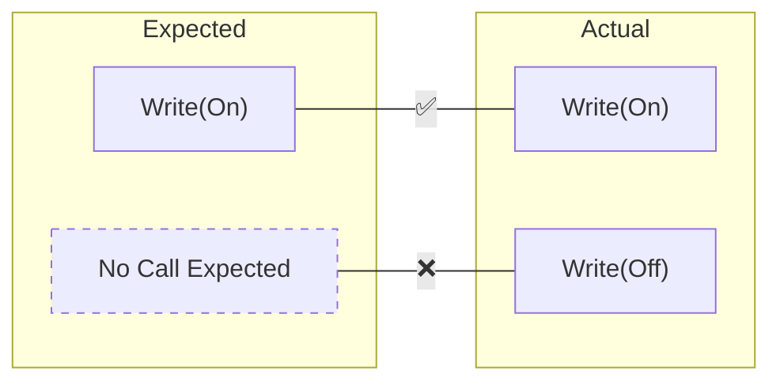

# Mocks Vs TestDoubles
Or what is a Mock?

---

# Why Do We Need

- Test's need ways to _prove_ that what we want to happen is happening
  - If tests just ran the code you wouldn't really prove much
- For simple things, just check the output

```c
uint8_t result = some_func(1,1);
CHECK_EQUAL(10, 1);
```

- What if the module we want to test _depends_ on another module?
  - In an object-oriented world you want something that can fulfil the responsibilities of an object
```c
SomeComplicatedModule_Init(instance, &someOtherComplicatedModule);
SomeComplicatedModule_DoSomething();
// prove that something has happened to someOtherComplicatedModule
```


---

# Testing Dependencies

- Here we broadly have two options for unit tests for a module with dependencies
  - TestDoubles
  - Mocks
- These are "not GE special names"
  - Some people have Fakes, Spys, Stubs, etc.
- Broadly these fall into two categories
  - Testing Data
  - Testing Interaction

---

# Testing Data (Test Doubles)

- Often we only need to prove what our module does to the data maintained by another module
- Think about blinky
```c
GivenBlinkyInit();
LedShouldBe(Off);
After(SomeBlinkPeriod);
LedShouldBe(On);
```

- Our primary concern is what Blinky does to the _state_ of the Led
- This can be modeled without needing an actual LED, just enough memory to model the state of one



----

# When Is This Not Enough?

```c
GivenBlinkyInit();
LedShouldBe(Off);
After(SomeBlinkPeriod - 1)
LedShouldBe(Off);
After(1);
LedShouldBe(On);
```

- Something that toggles the LED _way_ more often would still pass this test
- We prove that
  - at `t=0` and `t=SomeBlinkPeriod-1` the LED is off
  - at `t=SomeBlinkPeriod` the LED is on
- But the LED could _technically_ be anything at any other time
  - We might not care to prove something more rigorous
  - But what if it interacts with _many_ other modules?
  - What if the _order_ that it interacts with them is very specific?

---

# Proving Interactions

- Mocks let you prove out the specifics of two or more modules interacting
- They prove
  - Order of interactions*
  - Data used in interactions
- For Blinky
  - A test double shows what state the LED is in
  - A mock shows how the LED is asked to change

```c
TheLedShouldBeTurned(Off);
WhenBlinkyInit();

NothingShouldHappen()
After(SomeBlinkPeriod - 1);

TheLedShouldBeTurned(On);
After(1);
```

---

# How Does This Happen?

- The mock doesn't need to track the _state_ of the module
- It just needs to remember what _should_ happen and compare that to what _does_ happen



---

# How Does This Happen?
- The test builds up a list of "Expected Calls"
- When the mocking system sees an "Actual Call"
  - It looks at the list of expected calls
  - Compares if its the right call and if it was called with the right parameters
  - If the call was not expected or called with the wrong parameters, it errors

---
layout: two-cols
---

# How Does This Happen?

```c{1}
TheLedShouldBeTurned(On);
WhenBlinkyInit();

NothingShouldHappen()
After(SomeBlinkPeriod - 1);

TheLedShouldBeTurned(Off);
After(SomeBlinkPeriod);
```

::right::


---
layout: two-cols
---

# How Does This Happen?

```c{2}
TheLedShouldBeTurned(On);
WhenBlinkyInit();

NothingShouldHappen()
After(SomeBlinkPeriod - 1);

TheLedShouldBeTurned(Off);
After(SomeBlinkPeriod);
```

::right::


---
layout: two-cols
---

# How Does This Happen?

```c{4,5}
TheLedShouldBeTurned(On);
WhenBlinkyInit();

NothingShouldHappen()
After(SomeBlinkPeriod - 1);

TheLedShouldBeTurned(Off);
After(SomeBlinkPeriod);
```

::right::


---
layout: two-cols
---

# How Does This Happen?

```c{7}
TheLedShouldBeTurned(On);
WhenBlinkyInit();

NothingShouldHappen()
After(SomeBlinkPeriod - 1);

TheLedShouldBeTurned(Off);
After(SomeBlinkPeriod);
```

::right::


---
layout: two-cols
---

# How Does This Happen?

```c{8}
TheLedShouldBeTurned(On);
WhenBlinkyInit();

NothingShouldHappen()
After(SomeBlinkPeriod - 1);

TheLedShouldBeTurned(Off);
After(SomeBlinkPeriod);
```

::right::


---
layout: two-cols
---

# What If Something Had Happened?

```c{4,5}
TheLedShouldBeTurned(On);
WhenBlinkyInit();

NothingShouldHappen()
After(SomeBlinkPeriod - 1);

TheLedShouldBeTurned(Off);
After(SomeBlinkPeriod);
```

::right::

